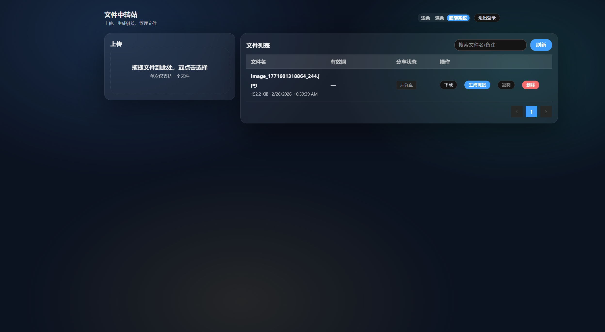

# 文件中转站（File Transfer Station）

> 一个基于 Vue 3 + FastAPI 的自托管文件中转与安全分享系统，支持提取码、有效期和下载次数限制。


s

## ✨ 功能亮点

- 管理员后台登录（JWT），仅授权用户可上传、管理与分享文件。
- 单文件拖拽上传，带实时进度反馈，默认支持最大 `1 GiB` 文件。
- 文件列表支持分页、搜索、删除与后台安全下载。
- 一键生成分享链接，可配置有效期、提取码、下载次数上限。
- 访客下载页支持失效态提示（过期 / 不存在 / 达到次数上限）。
- 下载采用短时令牌机制，避免直接暴露文件真实路径。

## 🚀 快速开始

### 安装

#### 方式一：Docker Compose（推荐）

```bash
# 1) 在项目根目录复制环境变量
cp .env.example .env

# 2) 一键启动前后端
docker compose up -d --build
```

启动后访问：

- 管理后台：`http://localhost:5273/admin/login`
- 分享页：`http://localhost:5273/s/<share_code>`
- 后端 API：`http://localhost:8003/api`

#### 方式二：本地开发启动

```bash
# backend
cd backend
cp .env.example .env
pip install -r requirements.txt
uvicorn app.main:app --host 0.0.0.0 --port 8003 --reload
```

```bash
# frontend
cd frontend
npm install
npm run dev
```

### 效果展示


### 使用示例

#### 示例 1：上传文件并生成分享链接（后台）

1. 打开 `http://localhost:5273/admin/login`，使用管理员账号登录。
2. 在上传区拖拽文件或点击选择上传。
3. 在文件列表中点击“生成链接”，设置提取码/有效期/下载次数后发送给访客。

#### 示例 2：访客通过分享页下载文件

1. 访问形如 `http://localhost:5273/s/<share_code>` 的链接。
2. 若链接设置了提取码，输入提取码并验证。
3. 获取下载令牌后自动开始下载。

#### 示例 3：通过 API 登录并获取 Token

```bash
curl -X POST http://localhost:8003/api/auth/login \
  -H "Content-Type: application/json" \
  -d "{\"username\":\"admin\",\"password\":\"admin\"}"
```

返回示例：

```json
{
  "token": "<jwt_token>",
  "expires_in": 86400
}
```

## 📖 详细文档

- 管理端核心接口：
  - `POST /api/auth/login`
  - `POST /api/files/upload`
  - `GET /api/files`
  - `POST /api/files/{file_id}/share`
- 访客端核心接口：
  - `GET /api/share/{share_code}`
  - `POST /api/share/{share_code}/verify`
  - `GET /api/share/{share_code}/download?token=...`

## 🛠️ 技术栈

- 前端：`Vue 3` + `TypeScript` + `Vite` + `Element Plus` + `Vue Router` + `Axios`
- 后端：`FastAPI` + `SQLAlchemy` + `PyJWT` + `bcrypt` + `python-multipart`
- 数据与存储：`SQLite`（默认）+ 本地文件系统存储
- 部署：`Docker` + `Docker Compose` + `Nginx`（前端容器）

## ⚙️ 配置说明

核心环境变量（后端使用 `APP_` 前缀）：

| 变量名 | 说明 | 默认值 |
|---|---|---|
| `APP_JWT_SECRET` | JWT 签名密钥（务必修改） | `admin` |
| `APP_ADMIN_USERNAME` | 管理员账号 | `admin` |
| `APP_ADMIN_PASSWORD` | 管理员密码 | `admin` |
| `APP_PUBLIC_BASE_URL` | 对外访问前端地址（用于拼接分享链接） | `http://localhost:5273` |
| `APP_CORS_ORIGINS` | 允许跨域来源（逗号分隔） | `http://localhost:5273` |
| `APP_DB_PATH` | SQLite 数据库路径 | `./data/app.db` |
| `APP_STORAGE_DIR` | 文件存储目录 | `../uploads` |
| `APP_MAX_UPLOAD_BYTES` | 单文件上传上限（字节） | `1073741824` |
| `APP_ADMIN_TOKEN_EXPIRES_SECONDS` | 管理员 Token 过期秒数 | `86400` |
| `APP_DOWNLOAD_TOKEN_EXPIRES_SECONDS` | 下载 Token 过期秒数 | `300` |

## 📄 开源许可

本项目基于 `MIT License` 开源，详见 `LICENSE`。

## ❤️ star 支持

如果这个项目对你有帮助，欢迎点一个 ⭐ 支持一下。
